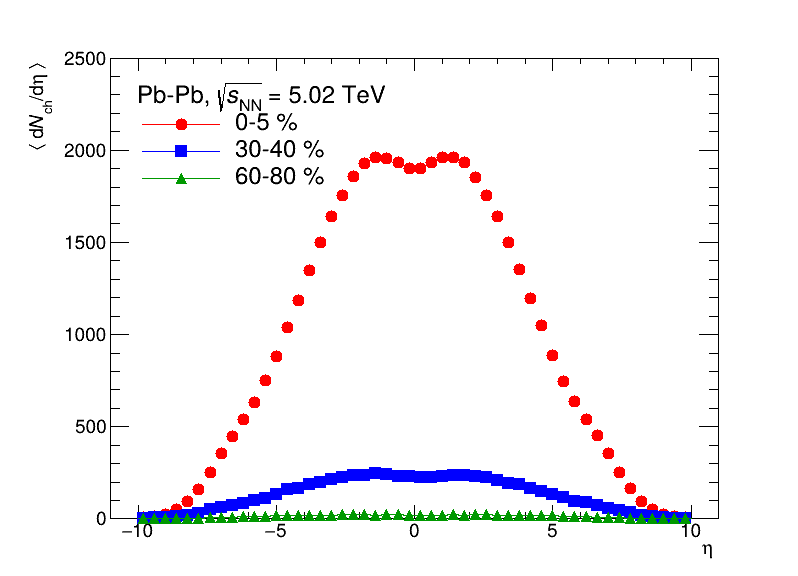
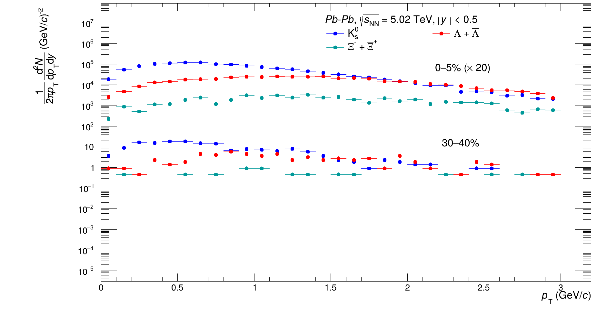
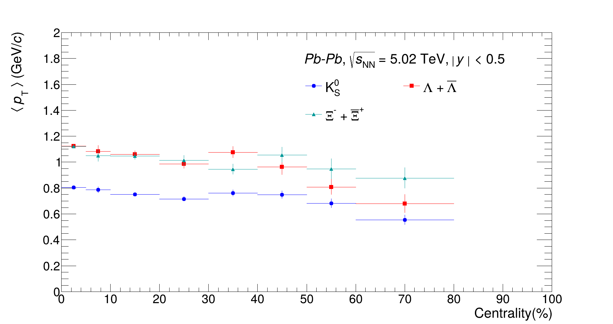
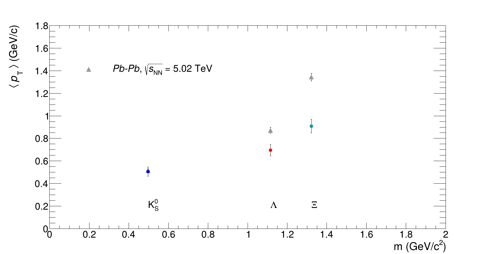

# Strange Particle Production in Pb-Pb Collisions at √s_NN = 5.02 TeV
### A PYTHIA8 Monte Carlo Study — MPhil Physics

[](https://root.cern/) [](https://pythia.org/) [](LICENSE)

---

## Overview

This repository presents the results of my **MPhil research project** on the production of strange particles — **K⁰ₛ (K-short)**, **Λ (Lambda)**, and **Ξ (Xi)** — in Pb-Pb collisions at a centre-of-mass energy per nucleon pair of **√s_NN = 5.02 TeV**, simulated using the **PYTHIA8** Monte Carlo event generator.

Strange particle production is a key observable in ultra-relativistic heavy-ion collisions. Enhanced strangeness production relative to pp collisions has long been proposed as a signature of **Quark-Gluon Plasma (QGP)** formation. This study systematically characterises K⁰ₛ, Λ, and Ξ using PYTHIA8 simulations, providing a Monte Carlo baseline for comparison with experimental data from the **ALICE detector** at the **LHC (CERN)**.

---

## Physics Motivation

| Particle | Quark Content | Strangeness |
|----------|--------------|-------------|
| K⁰ₛ      | (ds̄ − sd̄)/√2 | \|S\| = 1 |
| Λ        | uds           | \|S\| = 1 |
| Ξ⁻       | dss           | \|S\| = 2 |

- Strange quarks are absent in the initial-state nucleons, so strangeness must be **produced dynamically** in the collision.
- Multi-strange baryons (Ξ) are particularly sensitive probes of the medium formed in heavy-ion collisions.
- PYTHIA8 simulations serve as an important **perturbative QCD baseline** against which experimental measurements are benchmarked.

---

## Results

All histograms were generated using **ROOT** and are provided as standalone `.C` macros that can be run independently without the original simulation code.

---

### 1. Pseudorapidity (η) Distributions

> Mean charged particle multiplicity density ⟨dN_ch/dη⟩ as a function of pseudorapidity η
> for three centrality classes: 0–5% (central), 30–40% (semi-central), and 60–80% (peripheral)
> Pb-Pb collisions at √s_NN = 5.02 TeV. The characteristic bell-shaped distribution centered
> at η = 0 and the clear centrality ordering — central collisions producing far more particles
> than peripheral — are consistent with expected heavy-ion collision dynamics.



---

### 2. Lorentz-Invariant Transverse Momentum (pT) Spectra

> Lorentz-invariant transverse momentum spectra (1/2πpT) d²N/dpTdy of K⁰ₛ, Λ+Λ̄, and Ξ⁻+Ξ̄⁺
> at mid-rapidity |y| < 0.5 in Pb-Pb collisions at √s_NN = 5.02 TeV, for two centrality classes:
> 0–5% (scaled ×20 for visual separation) and 30–40%. Yields span several orders of magnitude on
> a logarithmic scale. The strangeness hierarchy K⁰ₛ > Λ > Ξ is clearly visible across all pT,
> consistent with increasing strange quark content suppressing production rates.



---

### 3. Mean Transverse Momentum vs Centrality

> Mean transverse momentum ⟨pT⟩ of K⁰ₛ, Λ+Λ̄, and Ξ⁻+Ξ̄⁺ as a function of collision
> centrality (0–80%) at mid-rapidity |y| < 0.5 in Pb-Pb collisions at √s_NN = 5.02 TeV.
> The mass ordering ⟨pT⟩(Ξ) > ⟨pT⟩(Λ) > ⟨pT⟩(K⁰ₛ) is clearly observed across all
> centralities, consistent with radial flow boosting heavier particles to higher momenta.
> A mild decrease in ⟨pT⟩ from central to peripheral collisions reflects the reduction
> of collective radial flow in less central events.



---

### 4. Mean Transverse Momentum vs Particle Mass (Radial Flow Signature)

> Mean transverse momentum ⟨pT⟩ as a function of particle rest mass m for K⁰ₛ, Λ, and Ξ
> in Pb-Pb collisions at √s_NN = 5.02 TeV. Colored circles show PYTHIA8 simulation results;
> grey triangles show a reference dataset for comparison. The linear rise of ⟨pT⟩ with
> particle mass is a direct signature of **collective radial flow** — the hydrodynamic
> expansion of the fireball imparts a common velocity boost to all particles, with heavier
> species acquiring proportionally larger momenta.



---

## How to Run

### Prerequisites
- [ROOT](https://root.cern/install/) (version 6.x recommended)
- No additional dependencies — the `.C` files are self-contained

### Running a Macro

```bash
# Launch ROOT and run any macro interactively
root results/pseudorapidity_distribution.C

# Or run in batch mode (no GUI)
root -b -q results/pseudorapidity_distribution.C
```

### Run All Four Results

```bash
root -b -q results/pseudorapidity_distribution.C
root -b -q results/pt_spectra_invariant.C
root -b -q results/mean_pt_vs_centrality.C
root -b -q results/mean_pt_vs_mass_radialflow.C
```

---

## Repository Structure

```
.
├── README.md
├── LICENSE
└── results/
    ├── pseudorapidity_distribution.C
    ├── pseudorapidity_distribution.png
    ├── pt_spectra_invariant.C
    ├── pt_spectra_invariant.png
    ├── mean_pt_vs_centrality.C
    ├── mean_pt_vs_centrality.png
    ├── mean_pt_vs_mass_radialflow.C
    └── mean_pt_vs_mass_radialflow.png
```

---

## Tools & Environment

| Tool | Purpose |
|------|---------|
| **PYTHIA 8** | Monte Carlo event generation for Pb-Pb collisions at 5.02 TeV |
| **ROOT (CERN)** | Data analysis, histogram filling, and visualisation |
| **C++** | Simulation and analysis code |

---

## Academic Context

- **Degree:** Master of Philosophy (MPhil) in Physics
- **Topic:** Study of Strange Particles (K⁰ₛ, Λ, Ξ) Production in Pb-Pb Collisions at √s_NN = 5.02 TeV using PYTHIA8
- **Relevant Experiment:** [ALICE (A Large Ion Collider Experiment)](https://alice.cern/), CERN LHC

---

## References

1. T. Sjöstrand et al., *PYTHIA 8.2*, Comput. Phys. Commun. 191 (2015) 159–177
2. ALICE Collaboration, *Enhanced production of multi-strange hadrons in high-multiplicity proton-proton collisions*, Nature Physics 13 (2017) 535–542
3. ALICE Collaboration, *Multiplicity dependence of (multi-)strange hadron production in proton-proton collisions*, Eur. Phys. J. C 80 (2020) 167

---

## License

This project is licensed under the MIT License — see the [LICENSE](LICENSE) file for details.
